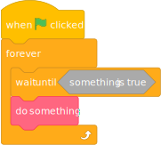
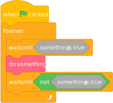

# Hats and events

import {ExtensionCode} from './utils.js';

Hat or event blocks allow scripts to run in response to arbitrary events.

## Edge-activated hats

This will be easiest to understand by comparing it to concepts you are already familiar with. How would you make a script run something when some boolean condition *becomes true*? You could do something like this:


This is great, but it will only work once. How could we make it work infinitely many times?



Almost. This has an issue: If "something" is still true when "do something" finishes, the loop will begin again immediately even though the condition didn't *become true*; it was *already true*. This can be fixed easily:



In essence, "edge-activated hats" let us rewrite that loop as:


For each instance of an edge-activated hat in a project, Scratch will run it once each frame. Only when the script switches from returning false to returning true will the script will run. Once the script starts, the hat function will not be called again until the script stops. This is available in both sandboxed and unsandboxed extensions.

There is one subtle difference between edge-activated hats and the loops above: Edge-activated hats can run even when the green flag isn't pressed.

To demonstrate this, we can reimplement the "when timer greater than" block in Scratch:

:::caution
TurboWarp's compiler currently does not support edge-activated hats, so these scripts will run in the slower Scratch interpreter.
:::

<ExtensionCode title="timer-reimplementation">{require("!raw-loader!@site/static/example-extensions/timer-reimplementation.js")}</ExtensionCode>

To test this, create a script such as "when timer > 3, say Hello for 1 second", run the reset timer block, then wait a few seconds. If you uncomment the comment in `whenTimerGreaterThan`, you will see an output like this in the JavaScript console when the script runs:

```js
2.719 false
2.753 false
2.785 false
2.818 false
2.851 false
2.885 false
2.918 false
2.951 false
2.985 false
3.017 true
4.113 true
4.148 true
4.181 true
4.214 true
4.248 true
4.281 true
4.314 true
4.347 true
4.381 true
```

As you can see, the moment the time reached 3 seconds, our function returned true, and the script began running. While the script is running, the hat function won't be called so the logs stop for one second. When the script finishes, the hat block will begin running again. As it continues to return true, there is no "edge activation" caused by switching from false to true, thus the script will not run again until the timer is reset.

Like any other block, a hat function can return a Promise that resolves to a boolean. Scratch will wait for it to resolve. Additionally, edge-activated hats can themselves contain arbitrarily complex hats such as variables or math. These are passed to the edge-activated hat, just like `TIME` in the example above.

## Event-based hats

While edge-activated hats work well for blocks like "when timer greater than", they don't work well for blocks like "when green flag pressed", "when I receive", or "when this sprite clicked". Unsandboxed extensions can instead use event-based hats which use an event-oriented system rather than constant polling.

:::info
Unlike edge-activated hats, TurboWarp's compiler fully supports event-based hats.
:::

To create an event-based HAT, define `isEdgeActivated: false` on the block. To run an event block, use `Scratch.vm.runtime.startHats("extensionid_opcode")`.

To demonstrate event-based hats, we will create several extensions similar to the broadcast system already in Scratch. These extensions do not interact with Scratch's broadcast system at all. It's just an easy way to demonstrate how event-based hats work.

Consider this extension that implements a very primitive version of broadcasts:

<ExtensionCode title="unsandboxed/broadcast-1">{require("!raw-loader!@site/static/example-extensions/unsandboxed/broadcast-1.js")}</ExtensionCode>

To test this, create a script using "when I receive the event" and then run "broadcast the event". Any scripts that begin with "when I receive the event" in any sprite will then begin to run.

The first argument that is passed into `startHats` is the block's full opcode, which is the extension ID, followed by an underscore, followed by the opcode specified in getInfo.

For event-based hats, the block itself doesn't run, so you don't need to create a function for the hat block. Notice how there is no "whenReceived" method in the extension class.

## Arguments

You may notice that having only one broadcast is a bit limiting. How do we make it so that there can be multiple broadcasts without making infinitely many unique blocks? We can add a menu with `acceptReporters: false` to the hat block and add a menu to the broadcast block. **The only arguments that event-based hats should contain are field menus (`acceptReporters: false`). Even simple text inputs are not supported.** This is the only time you should use `acceptReporters: false`.

Although in the example here the broadcast block uses the same menu, in real extensions this is not necessary. The broadcast block can use any type of arbitrarily complex input.

Then, the broadcast block can use the second parameter of startHats. startHats's second parameter is an object mapping the name of fields in the hat block to the expected value. Hat blocks that have a different value will not be started. If you specify no second argument, that means no filter, so all of the hats of that type will run.

<ExtensionCode title="unsandboxed/broadcast-2">{require("!raw-loader!@site/static/example-extensions/unsandboxed/broadcast-2.js")}</ExtensionCode>

In this example, the "broadcast [dropdown]" block only runs hats with that specific option, while the "broadcast all" block runs all hats regardless of dropdown value.

A hat can contain multiple fields. For example, if a hat has two dropdowns and you call startHats using a second argument that only has 1 value, it will only check that dropdown. If you specify multiple values in the second argument, it will check all of them.

## Restart existing threads

If you create a script using the previous example such as "when I receive event 1, wait 1 second, say Hello" and repeatedly run a "broadcast Event 1" block, you will see that the script keeps running instead of restarting when you broadcast it again as the 1 second timer is uninterrupted. If this isn't what you want, you can set `shouldRestartExistingThreads: true` on the hat block.

<ExtensionCode title="unsandboxed/broadcast-3">{require("!raw-loader!@site/static/example-extensions/unsandboxed/broadcast-3.js")}</ExtensionCode>

If you make the same script using this example and repeatedly run "broadcast Event 1", the "say Hello" block won't run as the script is constantly being restarted, thus restarting the 1 second timer.

## Starting scripts in only certain sprites

Consider a built-in hat block such as "when this sprite clicked" -- how does Scratch know that it should only start the hat in one specific sprite instead of all of them? It does this using the third argument to `startHats` which is the target you want to start it in. If set to null or not supplied at all, it will run for all sprites.

<ExtensionCode title="unsandboxed/broadcast-4">{require("!raw-loader!@site/static/example-extensions/unsandboxed/broadcast-4.js")}</ExtensionCode>

## Started thread list

Finally, `startHats` returns a list of the `Thread` objects that it started. You could use this to monitor thread status, determine how many threads were started, etc.

<ExtensionCode title="unsandboxed/broadcast-5">{require("!raw-loader!@site/static/example-extensions/unsandboxed/broadcast-5.js")}</ExtensionCode>

## EVENT blocks

Scratch.BlockType.EVENT exists, but there is no reason to use it instead of Scratch.BlockType.HAT.

## Exercises

1. Create an event-based hat block that runs every second.
2. Create a block with a text input that will run a normal Scratch broadcast. The built-in "when I receive" block has the full opcode "event_whenbroadcastreceived" and its single argument is called "BROADCAST_OPTION" which is the name of the broadcast.

## Next steps

We know a lot of APIs now, but [how do we make sure that the changes we make won't break projects?](./compatibility)
