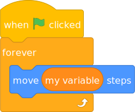

# How TurboWarp runs Scratch projects faster

TurboWarp uses a *compiler* to while Scratch uses an *interpreter*. This allows TurboWarp to run somewhere between 10-200x faster depending on the project, but it makes live script editing [impracticable](#live-script-editing).

export const Test = ({name, id, scratch, tw}) => (
  <tr>
    <td><a href={`https://scratch.mit.edu/projects/${id}/`}>{name}</a></td>
    <td>{scratch}</td>
    <td>{tw}</td>
  </tr>
);

<table style={{textAlign: "center"}}>
  <thead>
    <tr>
      <th>Test</th>
      <th>Scratch</th>
      <th>TurboWarp</th>
    </tr>
  </thead>
  <tbody>
    <Test name="Quicksort 200000 items" id="310372816" scratch="10.746s" tw="0.0528s" />
    <Test name="Cycles Raytracer r=1 s=10 dof=.08" id="412737809" scratch="832s" tw="16s" />
  </tbody>
</table>

(Tested in Chromium 103 on Linux)

Consider the following script:



Scratch's interpreter walks an [abstract syntax tree](https://en.wikipedia.org/wiki/Abstract_syntax_tree) at runtime. Internally that looks like this:

```json
{
  "va[U{Cbi_NZpSOSx_kVA": {
    "opcode": "event_whenflagclicked",
    "inputs": {},
    "fields": {},
    "next": "tzXnZ{8G!xK|t^WAWF{m",
    "topLevel": true
  },
  "tzXnZ{8G!xK|t^WAWF{m": {
    "opcode": "control_forever",
    "inputs": {
      "SUBSTACK": {
        "name": "SUBSTACK",
        "block": "$xf$bq|xl(}RhT-K,taS"
      }
    },
    "fields": {},
    "next": null,
    "topLevel": false
  },
  "$xf$bq|xl(}RhT-K,taS": {
    "opcode": "motion_movesteps",
    "inputs": {
      "STEPS": {
        "name": "STEPS",
        "block": "cw__.I:g}Y~`:5KmO00q"
      }
    },
    "fields": {},
    "next": null,
    "topLevel": false
  },
  "cw__.I:g}Y~`:5KmO00q": {
    "opcode": "data_variable",
    "inputs": {},
    "fields": {
      "VARIABLE": {
        "name": "VARIABLE",
        "id": "`jEk@4|i[#Fk?(8x)AV.-my variable"
      }
    },
    "next": null,
    "topLevel": false
  }
}
```

Whenever Scratch executes any block, it has to do a lot of things:

 - It has to look up the block using its ID and which function the block's opcode corresponds to.
 - If the block has inputs, those are also blocks, and must go through the same steps as any other block, and so must any deeper inputs.
 - It manually maintains a stack of blocks, loops, conditions, procedures, etc.
 - Scratch scripts can be yielded, so all of this has to happen in a way that can be paused and resumed later.
 - Scratch scripts can be changed while they're running, so caching everything ahead of time is difficult.
 - etc. There is a *lot* going on in Scratch whenever it executes even a single block.

The interpreter overhead is added on top of the overhead of JavaScript itself which is not insignificant as this code is very dynamic and can be hard for the JIT to optimize.

TurboWarp's compiler removes all of that overhead by converting scripts directly to JavaScript functions. For example, the above script becomes:

```js
const myVariable = stage.variables["`jEk@4|i[#Fk?(8x)AV.-my variable"];
return function* () {
  while (true) {
    runtime.ext_scratch3_motion._moveSteps((+myVariable.value || 0), target);
    yield;
  }
};
```

Things to notice:

 - No more looking up block IDs or opcodes: it's all just JavaScript.
 - No more looking up inputs manually: they're just JavaScript arguments.
 - No more manual state maintaining: your browser does it all for us.
 - As this is a single JavaScript function, we can't implement [live script editing](#live-script-editing)
 - This JavaScript looks very strange compared to typical human-written JavaScript and runs slower because we maintain compatibility with edge case Scratch behaviors.
 - We manually formatted the JavaScript and renamed some variables to make it more readable. The real code uses variable names like `b0` and has no formatting.

Of course, this is a very simple script where the interpreter overhead is negligible. This is the case for most projects. It's only when you start executing thousands of blocks per frame that the interpreter's overhead becomes significant.

Here's a more complex example: a naive sorting algorithm.

```js
const length = stage.variables["O;aH~(njYNn}Bl@}!%pS-length-"];
const list = stage.variables["O;aH~(njYNn}Bl@}!%pS-list-list"];
const newLength = stage.variables["O;aH~(njYNn}Bl@}!%pS-new-"];
const i = stage.variables["O;aH~(njYNn}Bl@}!%pS-i-"];
const temp = stage.variables["O;aH~(njYNn}Bl@}!%pS-tmp-"];
return function fun1_sort () {
  length.value = list.value.length;
  // repeat until length = 0
  while (!compareEqual(length.value, 0)) {
    newLength.value = 0;
    i.value = 1;
    // repeat length - 1 times
    for (var counter = ((+length.value || 0) - 1) || 0; counter >= 0.5; counter--) {
      // change i by 1
      i.value = ((+i.value || 0) + 1);
      // if item i - 1 of list is greater than item i of list
      if (
        compareGreaterThan(
          list.value[((((i.value || 0) - 1) || 0) | 0) - 1] ?? "",
          list.value[((i.value || 0) | 0) - 1] ?? ""
        )
      ) {
        // swap item i and i - 1 of list
        temp.value = listGet(list.value, i.value);
        listReplace(
          list,
          i.value,
          list.value[((((+i.value || 0) - 1) || 0) | 0) - 1] ?? ""
        );
        listReplace(
          list,
          (+i.value || 0) - 1,
          temp.value
        );
        newLength.value = i.value;
      }
    }
    length.value = newLength.value;
  }
};
```

### Live script editing {#live-script-editing}

If you start a script using the compiler, you won't be able to move, remove, or add blocks and have the changes be reflected in real time as they are in Scratch. The script has to be restarted. We believe there are some ways we could make this work, but they will hurt performance or add significant complexity. It's something we want to implement eventually, but not now.
