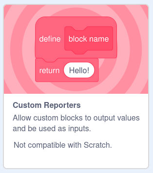

# Custom Reporters

TurboWarp now supports custom reporters which lets you use any custom block in your project as a reporter, like the addition block built into Scratch. This is a pretty standard feature in text-based programming languages, but it can be hard to understand initially.

:::info
This is an experimental new feature. We're expecting there to be quite a few bugs, and we will be experimenting with ways to make these easier to understand.

Projects that use this feature cannot be uploaded to the Scratch website.
:::

Custom reporters technically don't let you do anything you couldn't do before -- they just make it *much* easier to read and write. For example, if your project needs to repeat text a lot, you might make a script like this:

<!-- sorry for the bitmaps, scratchblocks was broken when I made these https://github.com/scratchblocks/scratchblocks/issues/486 -->

This works, but it's pretty ugly, and will only get worse as you use the block more. Using the return block to create a custom reporter, this becomes much simpler:

## How to use {#usage}

Open the extension library by clicking the button in the bottom left of the editor (same place where you find things like "pen"), then enable "Custom Reporters":

Then, create a custom block as you normally would. To make a custom reporter, just drag a "return" block into the script -- it'll be located at the bottom of the custom block list. You don't have to check any boxes or toggle anything.

Once a return block is hit, it functions similarly to "stop this script".

TurboWarp automatically reshapes blocks to what it guesses is the correct shape, but sometimes it guesses wrong. You can always change a block's shape by right clicking on it and then choosing "Changed To Stacked Block" or "Change To Reporter".

Similarly, if all the return blocks in a custom block contain a boolean (true/false) value such as "1 > 2", then the custom block will also be boolean-shaped. This is just a visual helper as any custom reporter can be dropped into any input.

## Recursion {#recursion}

Recursion is also supported. This can be especially hard to grasp, but basically, blocks can run themselves. If you can take a large problem and continuously break it down into smaller problems until you reach a known "base case", many algorithms can be written very elegantly.

Using recursion, you can rewrite the repeat block to use no variables at all:

Just like custom reporters themselves, recursion doesn't let you do anything that wasn't technically possible already, but it can make it much easier to understand. (Anything written with loops can be rewritten with recursion. Anything written with recursion can be rewritten with loops. Sometimes one solution is easier than the other.)

:::info
When using the compiler, beware of [stack overflow errors](https://en.wikipedia.org/wiki/Stack_overflow) from too much recursion. Recursing more than a few thousand calls deep typically will throw errors.
:::

## Differences between compiler and interpreter {#interpreter-compiler}

The interpreter supports infinite recursion whereas the compiler is limited by the JavaScript stack size, which is typically about a few thousand calls deep but varies between systems and browsers.

:::info
It is recommended to ensure that custom reporters only run some algorithm and output a final answer. To ensure your project runs the same in the compiler and interpreter, custom reporters should avoid things like moving sprites, saying text, waiting, etc.
:::

To improve performance, the compiler has a feature known as [short circuiting](https://en.wikipedia.org/wiki/Short-circuit_evaluation). Imagine a Scratch block like "&lt; (1 = 2) and (3 = 3) &gt;". When the compiler sees this block, it first evaluates "1 = 2", which is clearly false. In this case, the compiler doesn't even need to check the other side of the "and" block as it won't matter: the final result will always be false. Typically this is just free performance, but if your blocks have side effects such as moving sprites, different behaviors will occur as the interpreter always evaluates all blocks. Try this script to see:

If you have several custom reporters nested deeply inside other blocks, the order they run in can differ between the compiler and interpreter.
